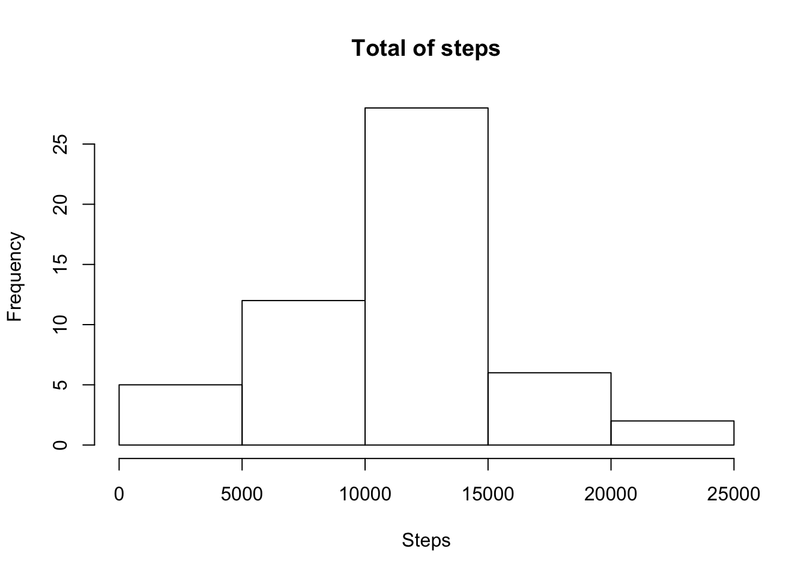
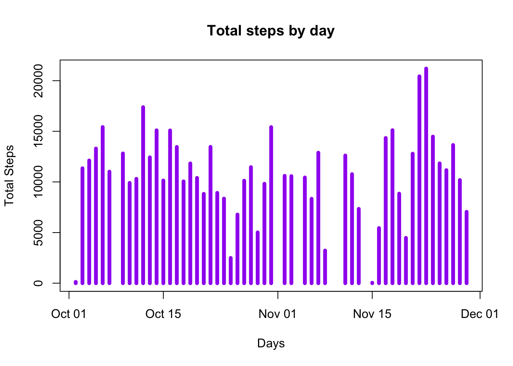
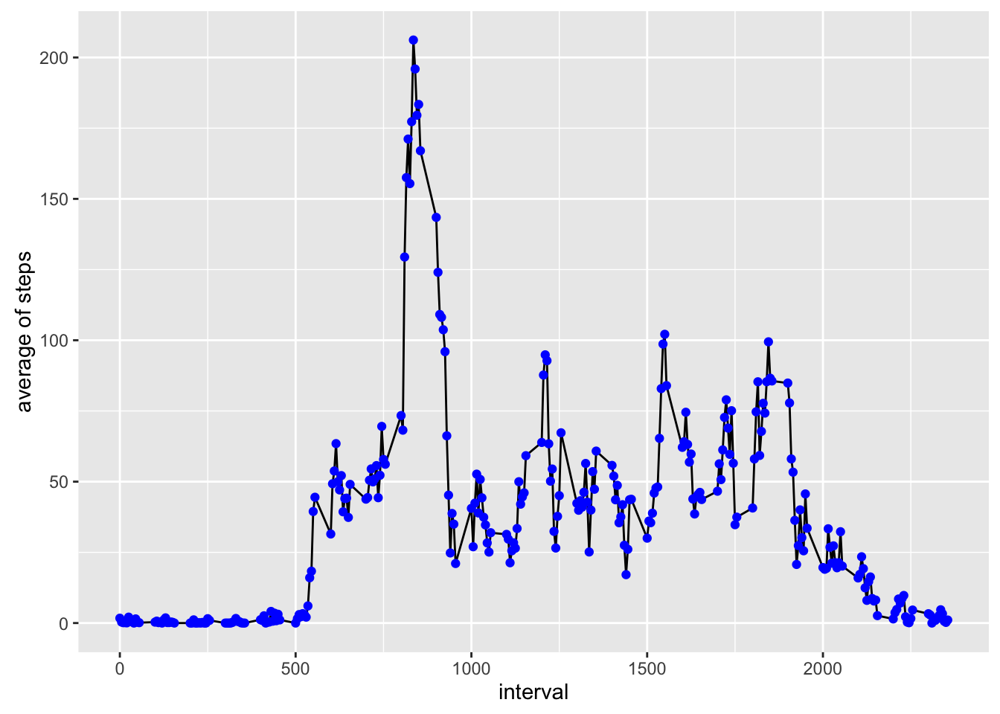
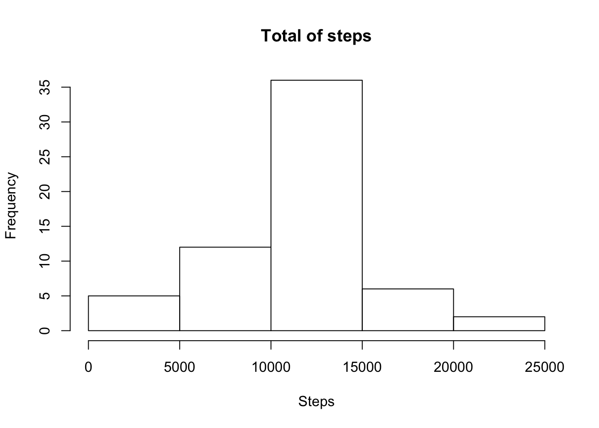
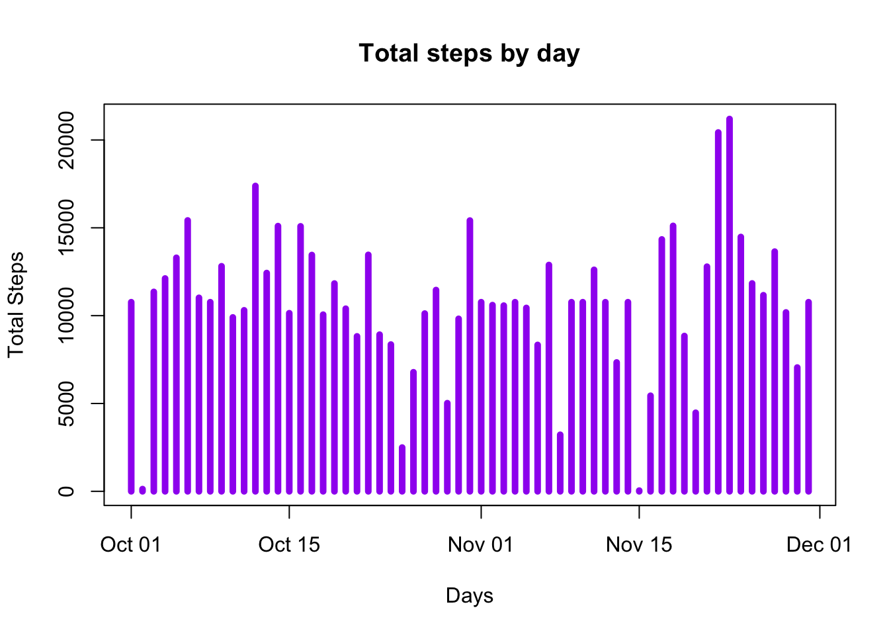
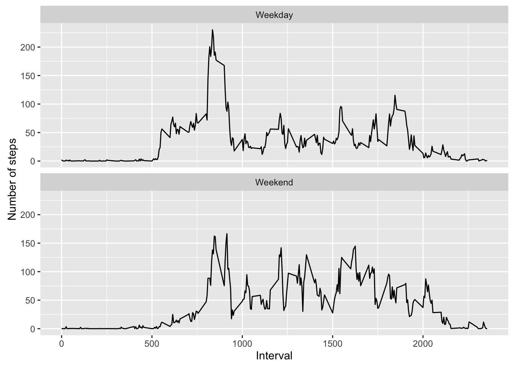

```{r setup, include=FALSE}
library("ggplot2"); library("plyr");
knitr::opts_chunk$set(echo = TRUE)
```
## Course Project 1

Loading and preprocessing the data

Show any code that is needed to

    Load the data (i.e. read.csv())

    Process/transform the data (if necessary) into a format suitable for your analysis

```r
setwd("~/datasciencecoursera/reproducible research/quiz1")
#url for download file
fileurl<-"https://d396qusza40orc.cloudfront.net/repdata%2Fdata%2Factivity.zip"
#route for work
if(!file.exists("./data")){dir.create("./data")}

#check zip file for download if doesn't exists
if(!file.exists("./data/erepdata%2Fdata%2Factivity.zip")){
    download.file(url = fileurl, destfile = "./data/repdata%2Fdata%2Factivity.zip")
    #unzip file
    unzip("./data/repdata%2Fdata%2Factivity.zip", exdir = "./data")    
}
```
```{r}
#read data
data<-read.csv("./data/activity.csv", header=TRUE)

#convert date 
data$date<-as.Date(data$date)

```
What is mean total number of steps taken per day?

For this part of the assignment, you can ignore the missing values in the dataset.

    Calculate the total number of steps taken per day
    If you do not understand the difference between a histogram and a barplot, research the difference between them. Make a histogram of the total number of steps taken each day
    Calculate and report the mean and median of the total number of steps taken per day

```{r}
#generate a new field for steps by day
data$stepsbyday<-weekdays(data$date)

#Calculate the total number of steps taken per day
SumSteps<-aggregate(data$steps ~ data$date, FUN=sum)
#set label of columns because remain last column name in operation
colnames(SumSteps)<-c("date","steps")

#hist does not shows a clear of data
hist(SumSteps$steps, xlab="Steps", ylab="Frequency", main="Total of steps")
```

```{r}
#a plot with hist type shows better
plot(SumSteps$date,SumSteps$steps, type="h",xlab="Days", ylab="Total Steps", main="Total steps by day", col="Purple", lwd=5)
```
 

```{r}
#Calculate and report the mean and median of the total number of steps 
#taken per day
mean(SumSteps$steps)
```
```
##10766.19
```
```{r}
#add a line with mean data
##abline(h=mean(SumSteps$steps), col="black", lwd=1)
#What is the average daily activity pattern?
median(SumSteps$steps)
```
```
##10765
```
```{r}
#add line with median data, is almost same data with mean operation
##abline(h=mean(SumSteps$steps), col="white", lwd=1)

```
    
What is the average daily activity pattern?

    Make a time series plot (i.e. type = "l") of the 5-minute interval (x-axis) and the average number of steps taken, averaged across all days (y-axis)
    Which 5-minute interval, on average across all the days in the dataset, contains the maximum number of steps?
    
```{r}
library(ggplot2)
av_steps<-aggregate(x=list(steps=data$steps), 
                    by=list(interval=data$interval),
                    FUN=mean,na.rm=TRUE)
ggplot(data=av_steps, aes(x=interval, y=steps))+ geom_line()+
    geom_point(colour='blue')+
    xlab("interval")+
    ylab("average of steps")
```
 
```{r}
#Which 5-minute interval, on average across all the days in the dataset, 
#contains the maximum number of steps?
av_steps[which.max(av_steps$steps),]  
```
```
##interval    steps
##104      835 206.1698
```

Imputing missing values

Note that there are a number of days/intervals where there are missing values (coded as NA). The presence of missing days may introduce bias into some calculations or summaries of the data.

    Calculate and report the total number of missing values in the dataset (i.e. the total number of rows with NAs)
    Devise a strategy for filling in all of the missing values in the dataset. The strategy does not need to be sophisticated. For example, you could use the mean/median for that day, or the mean for that 5-minute interval, etc.
    Create a new dataset that is equal to the original dataset but with the missing data filled in.
    Make a histogram of the total number of steps taken each day and Calculate and report the mean and median total number of steps taken per day. Do these values differ from the estimates from the first part of the assignment? What is the impact of imputing missing data on the estimates of the total daily number of steps?

```{r}
data_NA <- is.na(data$steps)
head(data_NA)
```
```
summary(data_NA)
##   Mode   FALSE    TRUE    NA's 
##logical   15264    2304       0 
```
```{r}
library(plyr)
#rename col name for don't duplicate column
colnames(av_steps)<-c("interval","step_join")
#join data , beginning data with filter data
joindata<-join(data,av_steps, by="interval")
#show data
head(joindata)
#replace data NA with average steps by interval join
joindata$steps[is.na(joindata$steps)]<- joindata$step_join[is.na(joindata$steps)]
head(joindata)

#Calculate the total number of steps taken per day for new data set
SumSteps_clear<-aggregate(joindata$steps ~ joindata$date, FUN=sum)
#set label of columns because remain last column name in operation
colnames(SumSteps_clear)<-c("date","steps")
head(SumSteps_clear)

#hist does not shows a clear of data
hist(SumSteps_clear$steps, xlab="Steps", ylab="Frequency", main="Total of steps")
```
 
```{r}
#a plot with hist type shows better
plot(SumSteps_clear$date,SumSteps_clear$steps, type="h",xlab="Days", ylab="Total Steps", main="Total steps by day", col="Purple", lwd=5)
```
 
```{r}
#Calculate and report the mean and median of the total number of steps 
#taken per day
mean(SumSteps_clear$steps)
```
```
##10766.19
##add a line with mean data
abline(h=mean(SumSteps_clear$steps), col="black", lwd=1)
```
```{r}
#What is the average daily activity pattern?
median(SumSteps_clear$steps)
```
```
##10766.19
```
Are there differences in activity patterns between weekdays and weekends?

For this part the weekdays() function may be of some help here. Use the dataset with the filled-in missing values for this part.

    Create a new factor variable in the dataset with two levels – “weekday” and “weekend” indicating whether a given date is a weekday or weekend day.
    Make a panel plot containing a time series plot (i.e. type = "l") of the 5-minute interval (x-axis) and the average number of steps taken, averaged across all weekday days or weekend days (y-axis). See the README file in the GitHub repository to see an example of what this plot should look like using simulated data.

```{r}
#Are there differences in activity patterns between weekdays and weekends?
mean_data <- mean(SumSteps_clear$steps) - mean(SumSteps$steps)
#0
median_data <- median(SumSteps_clear$steps) - median(SumSteps$steps)
#1.1886792452824
total <- sum(SumSteps_clear$steps) - sum(SumSteps$steps)
#86129.50

#put day in new column var
joindata$stepsbyday<-weekdays(joindata$date)
#put week or weekend 
joindata$week <- ifelse(joindata$stepsbyday %in% c("Saturday", "Sunday"), "Weekend", "Weekday")
head(joindata)
```
```{r}
aveg <- aggregate(steps ~ interval + week, data=joindata, mean)
ggplot(aveg, aes(interval, steps)) + geom_line() + facet_grid(week ~ .) +
    xlab("Interval") + ylab("Number of steps")+
    facet_wrap(~ week, ncol=1)
```    
 
